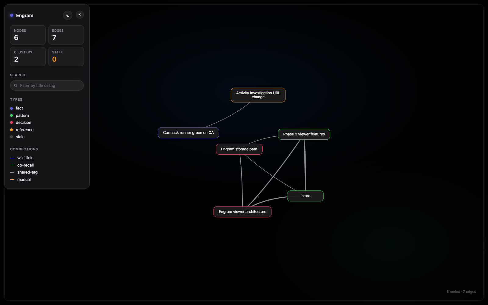

# Engram

<p align="center">
  
</p>

> *"The engram is the enduring change which the stimulus leaves behind in
> the organism — the trace that makes recall possible."*
> — Richard Semon, *Die Mneme*, 1904 (paraphrased)

A **self-sufficient, local-first, deterministic memory layer** for AI sessions,
paired with a force-directed graph viewer for the knowledge it accumulates.

The AI is dumb plumbing. Engram does the chunking, indexing, ranking, and
visualisation. No subscriptions, no cloud calls, no LLM in the storage path.

## Why

| Problem                                | Engram                                            |
| -------------------------------------- | ------------------------------------------------ |
| AI sessions are amnesiac               | `recall` injects relevant prior knowledge        |
| Re-research wastes tokens              | Deterministic index returns answers in < 200 ms  |
| Knowledge dies in chat history         | Stored as plain markdown, git-versionable        |
| No way to *see* what you know          | A live, navigable graph                          |
| Stale facts go silently wrong          | TTLs + loud-stale banners + verification flow    |

## Install

Requires Python 3.11+.

```powershell
git clone https://github.com/NathanBhamra/engram.git
cd engram
.\scripts\bootstrap.ps1
```

This creates a virtualenv in `.venv\`, installs Engram in editable mode with
all dev dependencies, vendors the viewer JS, and applies the initial schema.

## First run

```powershell
# Store a note from stdin
"Force-directed graphs animate well with cubic-bezier(.4,0,.2,1) easing." | engram store --type pattern --tag viz --tag css

# Recall it later
engram recall "graph easing curve"

# See your knowledge graph
engram view --open
```

## The viewer

Engram ships with a static HTML force-directed graph viewer powered by
[vis-network]. It's a single self-contained file — drag it into any browser.

- **iOS-grade palette** in both light and dark mode (runtime toggle).
- **Floating sidebar** that collapses to an engraved "Engram" watermark to
  maximise graph real estate.
- **Pinned multi-card details** — click a node to inspect, pin to keep it
  visible while exploring, click empty space to dismiss unpinned cards.
- **Search, type/connection filters, cluster + stale counts** in the sidebar.

[vis-network]: https://github.com/visjs/vis-network

```powershell
engram view --out viz.html --open
```

## Documentation

The full documentation lives in [`docs/`](docs/) and is built with
`mkdocs-material`:

```powershell
.\scripts\make-docs.ps1
```

Key entry points:

- [Why deterministic?](docs/concepts/why-deterministic.md)
- [Architecture](ARCHITECTURE.md)
- [Design decisions](docs/design/decisions.md)

## Status

Alpha. Phase 1 (CLI) and Phase 2 (viewer) shipped. Phase 3 (auto-store via
agent hooks) in progress. See [`CHANGELOG.md`](CHANGELOG.md) for what's shipped.

## Licence

[MIT](LICENSE).
